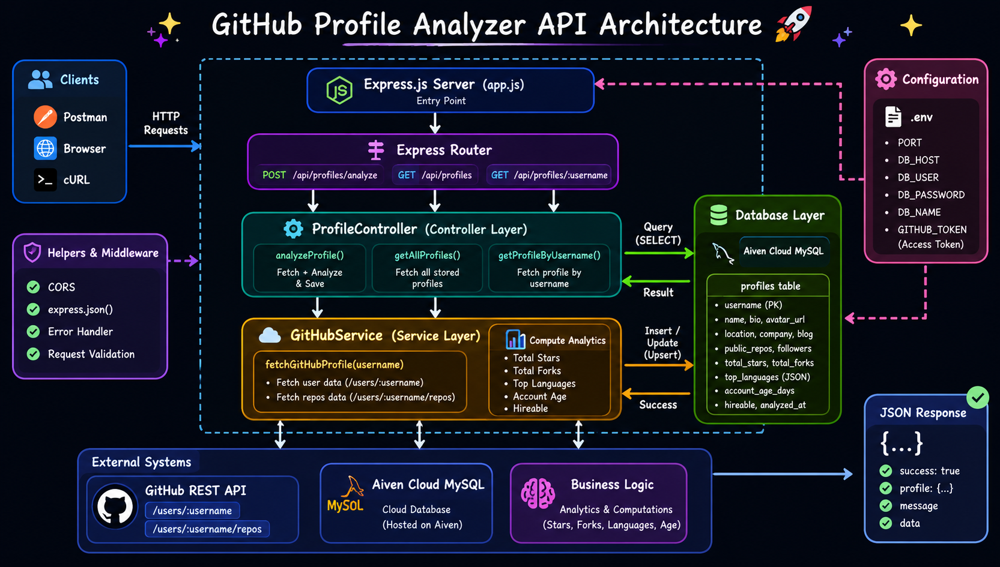

# 🚀 GitHub Profile Analyzer API

<div align="center">

[](https://nodejs.org/)
[](https://expressjs.com/)
[](https://www.mysql.com/)
[](https://axios-http.com/)
[](LICENSE)

</div>

---

## 🌐 Live Demo

**API Base URL:** [`https://github-analyzer-efiy.onrender.com/`](https://github-analyzer-efiy.onrender.com/)

Try the API endpoints directly using Postman or any HTTP client:
- Health Check: `https://github-analyzer-efiy.onrender.com/`
- All Profiles: `https://github-analyzer-efiy.onrender.com/api/profiles`

---

## 📋 Table of Contents

- [Overview](#overview)
- [Features](#features)
- [Tech Stack](#tech-stack)
- [Project Structure](#project-structure)
- [Prerequisites](#prerequisites)
- [Local Setup](#local-setup)
- [Environment Variables](#environment-variables)
- [API Endpoints](#api-endpoints)
- [Database Schema](#database-schema)
- [Deployment](#deployment)
- [Error Handling](#error-handling)


---

## 📖 Overview

**GitHub Profile Analyzer API** is a RESTful backend service built with Node.js and Express.js that fetches and analyzes GitHub user profiles. The API retrieves public profile data from the GitHub REST API and stores enriched insights in a MySQL database, providing valuable metrics about developers and their contributions.

This service is designed to:
- ✅ Fetch real-time GitHub profile data
- ✅ Compute advanced insights (total stars, top languages, account age)
- ✅ Store and manage profiles in a persistent database
- ✅ Provide quick access to analyzed profiles with a simple REST API
- ✅ Handle high-volume requests with optimized database operations

---

## 🏗️ Project Architecture

<div align="center">



</div>

---

## ⭐ Features

### Core Features
- **GitHub Profile Analysis**: Fetches comprehensive public profile data using the GitHub REST API
- **Parallel Data Fetching**: Simultaneously retrieves user profiles and repository data for performance optimization
- **Auto-Database Setup**: MySQL table is automatically created and initialized on server startup—no manual SQL scripts needed
- **Smart Caching**: Store and update analyzed profiles in MySQL for instant retrieval

### Computed Insights
- 📊 **Total Stars**: Aggregated stargazer count across all public repositories
- 🔀 **Total Forks**: Aggregated fork count from all repositories
- 🗣️ **Top Languages**: Top 5 programming languages by frequency across user repositories
- 📅 **Account Age**: Calculated days since GitHub account creation
- 🏆 **Public Statistics**: Followers, following count, and public repository count
- 👤 **Complete Profile**: Name, bio, location, company, blog, Twitter handle, and avatar

### Smart Features
- 🔄 **Re-analysis Support**: Analyze the same profile multiple times to get updated metrics
- 🗓️ **Timestamp Tracking**: Automatic `analyzed_at` timestamp updates on each analysis
- 🛡️ **Error Handling**: Comprehensive error responses with meaningful messages
- ⚡ **Rate Limit Optimization**: Optional GitHub token support to increase API rate limits from 60 to 5,000 requests/hour
- 🔒 **Input Validation**: Username validation and sanitization on all endpoints

---

## 🛠 Tech Stack

| Technology | Version | Purpose |
|:-----------|:-------:|---------|
| **Node.js** | 18+ | JavaScript runtime |
| **Express.js** | 5.2.1 | Web framework |
| **MySQL 2** | 3.22.4 | Database driver with promise support |
| **Axios** | 1.16.1 | HTTP client for GitHub API calls |
| **Dotenv** | 17.4.2 | Environment variable management |
| **CORS** | 2.8.6 | Cross-origin resource sharing |
| **Render.com** | - | Production hosting platform |
| **Aiven Cloud** | - | Managed MySQL hosting |

---

## 📁 Project Structure

```
github-analyzer/
├── src/
│   ├── server.js                    # 🔌 Application entry point & express setup
│   ├── config/
│   │   └── db.js                    # 📦 MySQL connection pool & auto table creation
│   ├── services/
│   │   └── githubService.js         # 🔗 GitHub API integration & data computation
│   ├── controllers/
│   │   └── profileController.js     # 🎮 Request handlers for all 3 endpoints
│   ├── routes/
│   │   └── profileRoutes.js         # 🛣️  API route definitions
│   └── middleware/
│       └── errorHandler.js          # ⚠️  Global error handling middleware
├── schema.sql                       # 📋 Database schema reference
├── .env.example                     # 📝 Environment variables template
├── .gitignore                       # 🚫 Git ignore rules
├── package.json                     # 📦 Project dependencies & scripts
└── README.md                        # 📚 This file
```

### Directory Breakdown

- **`src/`** - Main application source code
- **`src/config/`** - Database configuration and connection pooling
- **`src/services/`** - Business logic and external API integrations
- **`src/controllers/`** - HTTP request/response handlers
- **`src/routes/`** - API endpoint route definitions
- **`src/middleware/`** - Express middleware for error handling and processing

---

## 🔧 Prerequisites

Before you begin, ensure you have the following installed:

- **Node.js** (v18 or higher) - [Download](https://nodejs.org/)
- **npm** (v9 or higher, comes with Node.js)
- **Git** - [Download](https://git-scm.com/)
- **MySQL Database** (local or cloud-hosted like Aiven)
- **GitHub Account** (for obtaining a personal access token, optional but recommended)

### Verify Installation

```bash
node --version    # Should be v18 or higher
npm --version     # Should be v9 or higher
git --version     # Any recent version
```

---

## 🚀 Local Setup

Follow these step-by-step instructions to set up the project locally:

### Step 1: Clone the Repository

```bash
git clone https://github.com/yourusername/github-analyzer.git
cd github-analyzer
```

### Step 2: Install Dependencies

```bash
npm install
```

This installs all required packages listed in `package.json`:
- express (web framework)
- mysql2 (database driver)
- axios (HTTP client)
- dotenv (environment variables)
- cors (cross-origin support)

### Step 3: Set Up Environment Variables

Copy the example environment file and configure it:

```bash
cp .env.example .env
```

Then open `.env` and update the values with your actual credentials. See the [Environment Variables](#environment-variables) section below.

### Step 4: Configure MySQL Database

You can use either:

#### Option A: Local MySQL
If you have MySQL installed locally:
```bash
# No additional setup needed - db.js will create the table automatically
```

#### Option B: Aiven Cloud MySQL (Recommended for Production)
1. Create an account at [Aiven.io](https://aiven.io/)
2. Create a MySQL service
3. Copy connection details from Aiven Console → Your Service → Overview
4. Add them to your `.env` file

### Step 5: Start the Server

**Development mode** (with auto-reload on file changes):
```bash
npm run dev
```

**Production mode**:
```bash
npm start
```

You should see output like:
```
✅ DB connected and table ready
Server running on http://localhost:3000
```

### Step 6: Test the Server

**Using Postman:**
- **Method**: `GET`
- **URL**: `http://localhost:3000`
- Click **Send**
- Expected response:
  ```json
  {
    "status": "ok",
    "message": "GitHub Profile Analyzer API"
  }
  ```

---

## 🔐 Environment Variables

Create a `.env` file in the root directory. Below are all required and optional variables:

| Variable | Type | Required | Description | Example |
|----------|------|----------|-------------|---------|
| `PORT` | Number | ✅ | Server port | `3000` |
| `NODE_ENV` | String | ✅ | Environment mode | `development` or `production` |
| `DB_HOST` | String | ✅ | Database host address | `mysql-abc.aivencloud.com` |
| `DB_PORT` | Number | ✅ | Database port | `12345` |
| `DB_USER` | String | ✅ | Database username | `avnadmin` |
| `DB_PASSWORD` | String | ✅ | Database password | `your_secure_password` |
| `DB_NAME` | String | ✅ | Database name | `github_analyzer` |
| `DB_SSL` | Boolean | ✅ | Enable SSL for DB connection | `true` (recommended for cloud) |
| `GITHUB_TOKEN` | String | ❌ | GitHub personal access token | `ghp_xxxxxxxxxxxxxxxxxxxx` |

### Example `.env` File

```env
# Server Configuration
PORT=3000
NODE_ENV=development

# MySQL Database (Aiven Cloud)
DB_HOST=mysql-xxxxxxxxx.aivencloud.com
DB_PORT=12345
DB_USER=avnadmin
DB_PASSWORD=your_very_secure_password
DB_NAME=github_analyzer
DB_SSL=true

# GitHub API (Optional - increases rate limit 60 → 5000/hr)
GITHUB_TOKEN=ghp_xxxxxxxxxxxxxxxxxxxxxxxxxxxx
```

### How to Get a GitHub Token

1. Go to [GitHub Personal Access Tokens](https://github.com/settings/tokens)
2. Click "Generate new token"
3. Select scopes (public_repo access is sufficient)
4. Copy the token and add it to your `.env`
5. **Never commit tokens to Git!**

---

## 🔌 API Endpoints

### 1️⃣ Analyze a GitHub Profile

**Fetch a GitHub user's data and store it in the database**

```http
POST /api/profiles/analyze
Content-Type: application/json

{
  "username": "torvalds"
}
```

#### Request (Postman)

**Step 1:** Open Postman and create a new request

**Step 2:** Set up the request:
- **Method**: `POST`
- **URL**: `http://localhost:3000/api/profiles/analyze`
- **Headers Tab**: Add header
  - Key: `Content-Type`
  - Value: `application/json`
- **Body Tab**: Select `raw` → `JSON`
  ```json
  {
    "username": "torvalds"
  }
  ```

**Step 3:** Click **Send**

#### Responses

**✅ Success (200)**
```json
{
  "success": true,
  "profile": {
    "id": 1,
    "username": "torvalds",
    "name": "Linus Torvalds",
    "bio": "Linux creator",
    "avatar_url": "https://avatars.githubusercontent.com/u/1024...",
    "location": "Portland, USA",
    "blog": "https://www.kernel.org/",
    "company": "The Linux Foundation",
    "twitter_username": null,
    "public_repos": 15,
    "followers": 250000,
    "following": 0,
    "total_stars": 185000,
    "total_forks": 42000,
    "top_languages": [["C", 12], ["Python", 2], ["Shell", 1]],
    "account_age_days": 6045,
    "hireable": 0,
    "analyzed_at": "2026-05-31T14:30:45.000Z",
    "created_at": "2026-05-31T10:15:22.000Z"
  }
}
```

**❌ Error - User Not Found (404)**
```json
{
  "error": "GitHub user not found"
}
```

**❌ Error - Missing Username (400)**
```json
{
  "error": "Username is required"
}
```

**❌ Error - Server Error (500)**
```json
{
  "error": "Internal Server Error",
  "details": "Error message here (only in development mode)"
}
```

---

### 2️⃣ Get All Stored Profiles

**Retrieve all analyzed profiles from the database**

```http
GET /api/profiles
```

#### Request (Postman)

**Step 1:** Open Postman and create a new request

**Step 2:** Set up the request:
- **Method**: `GET`
- **URL**: `http://localhost:3000/api/profiles`

**Step 3:** Click **Send**

#### Response

**✅ Success (200)**
```json
{
  "success": true,
  "count": 3,
  "profiles": [
    {
      "id": 1,
      "username": "torvalds",
      "name": "Linus Torvalds",
      "bio": "Linux creator",
      "avatar_url": "https://avatars.githubusercontent.com/u/1024...",
      "location": "Portland, USA",
      "blog": "https://www.kernel.org/",
      "company": "The Linux Foundation",
      "twitter_username": null,
      "public_repos": 15,
      "followers": 250000,
      "following": 0,
      "total_stars": 185000,
      "total_forks": 42000,
      "top_languages": [["C", 12], ["Python", 2], ["Shell", 1]],
      "account_age_days": 6045,
      "hireable": 0,
      "analyzed_at": "2026-05-31T14:30:45.000Z",
      "created_at": "2026-05-31T10:15:22.000Z"
    },
    {
      "id": 2,
      "username": "guido",
      "name": "Guido van Rossum",
      "bio": "Python creator",
      ...
    }
  ]
}
```

**Note**: Profiles are ordered by `analyzed_at` timestamp in descending order (most recently analyzed first).

---

### 3️⃣ Get Profile by Username

**Retrieve a specific profile by username from the database**

```http
GET /api/profiles/:username
```

#### Request (Postman)

**Step 1:** Open Postman and create a new request

**Step 2:** Set up the request:
- **Method**: `GET`
- **URL**: `http://localhost:3000/api/profiles/torvalds`

**Step 3:** Click **Send**

**Note:** Replace `torvalds` with any other GitHub username you've already analyzed

#### Responses

**✅ Success (200)**
```json
{
  "success": true,
  "profile": {
    "id": 1,
    "username": "torvalds",
    "name": "Linus Torvalds",
    "bio": "Linux creator",
    "avatar_url": "https://avatars.githubusercontent.com/u/1024...",
    "location": "Portland, USA",
    "blog": "https://www.kernel.org/",
    "company": "The Linux Foundation",
    "twitter_username": null,
    "public_repos": 15,
    "followers": 250000,
    "following": 0,
    "total_stars": 185000,
    "total_forks": 42000,
    "top_languages": [["C", 12], ["Python", 2], ["Shell", 1]],
    "account_age_days": 6045,
    "hireable": 0,
    "analyzed_at": "2026-05-31T14:30:45.000Z",
    "created_at": "2026-05-31T10:15:22.000Z"
  }
}
```

**❌ Error - Profile Not Found (404)**
```json
{
  "success": false,
  "error": "Profile not found in database."
}
```

**Note**: The profile must be analyzed first using the `/api/profiles/analyze` endpoint before it can be retrieved.

---

## 💾 Database Schema

### Profiles Table

```sql
CREATE TABLE IF NOT EXISTS profiles (
  id               INT AUTO_INCREMENT PRIMARY KEY,
  username         VARCHAR(100) UNIQUE NOT NULL,
  name             VARCHAR(200),
  bio              TEXT,
  avatar_url       VARCHAR(500),
  location         VARCHAR(200),
  blog             VARCHAR(500),
  company          VARCHAR(200),
  twitter_username VARCHAR(100),
  public_repos     INT DEFAULT 0,
  followers        INT DEFAULT 0,
  following        INT DEFAULT 0,
  total_stars      INT DEFAULT 0,
  total_forks      INT DEFAULT 0,
  top_languages    JSON,
  account_age_days INT DEFAULT 0,
  hireable         TINYINT(1),
  analyzed_at      TIMESTAMP DEFAULT CURRENT_TIMESTAMP ON UPDATE CURRENT_TIMESTAMP,
  created_at       TIMESTAMP DEFAULT CURRENT_TIMESTAMP
);
```

### Column Descriptions

| Column | Type | Description |
|--------|------|-------------|
| `id` | INT | Primary key, auto-incrementing |
| `username` | VARCHAR(100) | GitHub username (unique) |
| `name` | VARCHAR(200) | User's full name |
| `bio` | TEXT | User's bio/description |
| `avatar_url` | VARCHAR(500) | URL to user's avatar image |
| `location` | VARCHAR(200) | User's location |
| `blog` | VARCHAR(500) | User's blog/website URL |
| `company` | VARCHAR(200) | User's company name |
| `twitter_username` | VARCHAR(100) | Twitter handle |
| `public_repos` | INT | Number of public repositories |
| `followers` | INT | Number of followers |
| `following` | INT | Number of users they follow |
| `total_stars` | INT | Sum of stars across all repos |
| `total_forks` | INT | Sum of forks across all repos |
| `top_languages` | JSON | Top 5 languages as JSON array |
| `account_age_days` | INT | Days since account creation |
| `hireable` | TINYINT(1) | Boolean (0 or 1) |
| `analyzed_at` | TIMESTAMP | Last analysis timestamp (auto-updates) |
| `created_at` | TIMESTAMP | Initial record creation timestamp |

### ⚠️ Important Note: Automatic Table Creation

**The `profiles` table is automatically created on server startup.** You do not need to run any manual SQL scripts. When the server starts:

1. `src/config/db.js` establishes a connection pool
2. The `initDB()` function runs automatically
3. If the table doesn't exist, it's created with the schema above
4. If the table exists, no changes are made
5. You'll see: `✅ DB connected and table ready`

---

## 🌐 Deployment

### Deploy to Render.com

#### Step 1: Prepare Your Repository

1. Push your code to GitHub:
```bash
git add .
git commit -m "Initial commit"
git push origin main
```

2. Ensure `.env` is in `.gitignore` (it should be)

#### Step 2: Set Up Render Service

1. Go to [Render.com](https://render.com/) and sign up
2. Click "New +" → "Web Service"
3. Connect your GitHub repository
4. Fill in the details:
   - **Name**: `github-analyzer` (or your preferred name)
   - **Environment**: `Node`
   - **Build Command**: `npm install`
   - **Start Command**: `npm start`

#### Step 3: Add Environment Variables

In the Render dashboard:

1. Go to your service settings
2. Scroll to "Environment"
3. Add all variables from `.env`:
   - `PORT=3000`
   - `NODE_ENV=production`
   - `DB_HOST=your-aiven-host`
   - `DB_PORT=12345`
   - `DB_USER=avnadmin`
   - `DB_PASSWORD=your_password`
   - `DB_NAME=github_analyzer`
   - `DB_SSL=true`
   - `GITHUB_TOKEN=your_token` (optional)

#### Step 4: Deploy

1. Click "Create Web Service"
2. Render will automatically deploy your app
3. View logs to confirm: `✅ DB connected and table ready`
4. Your API will be available at: `https://your-app-name.onrender.com`

### Aiven MySQL Setup

#### Step 1: Create MySQL Service on Aiven

1. Go to [Aiven.io](https://aiven.io/)
2. Create a new MySQL service
3. Select your region and plan
4. Wait for service to initialize

#### Step 2: Get Connection Details

1. Go to Service Overview
2. Copy:
   - **Host**: `mysql-xxx.aivencloud.com`
   - **Port**: `12345`
   - **User**: `avnadmin`
   - **Password**: (from service credentials)
3. Add these to Render environment variables

#### Step 3: Connect from Render

The database table will auto-create on first server start with the environment variables set.

### Production Best Practices

```env
# Use in production:
NODE_ENV=production
DB_SSL=true
PORT=3000

# Security:
# - Always use HTTPS/SSL for database connections
# - Use strong DB passwords (30+ characters)
# - Rotate GitHub tokens regularly
# - Use Render's secrets feature, not plain environment variables
# - Enable GitHub token (increases rate limits significantly)
```

---

## 🚨 Error Handling

The API includes comprehensive error handling:

### Global Error Handler Middleware

Located in `src/middleware/errorHandler.js`, it:
- Catches all unhandled errors
- Logs errors to console
- Returns appropriate HTTP status codes
- Hides sensitive error details in production (only shows in development)

### Error Response Format

```json
{
  "error": "Error message",
  "details": "Full error details (development mode only)"
}
```

### Common Error Scenarios

| Scenario | Status | Message |
|----------|--------|---------|
| Missing username | 400 | "Username is required" |
| GitHub user doesn't exist | 404 | "GitHub user not found" |
| Profile not in database | 404 | "Profile not found in database." |
| Database connection error | 500 | "Internal Server Error" |
| GitHub API rate limit exceeded | 403 | GitHub API error (use GITHUB_TOKEN) |

---

## 📚 Usage Examples

### Example 1: Analyze Multiple Developers

#### Request 1: Analyze Linus Torvalds (Postman)
- **Method**: `POST`
- **URL**: `http://localhost:3000/api/profiles/analyze`
- **Headers**: `Content-Type: application/json`
- **Body** (raw JSON):
  ```json
  {"username": "torvalds"}
  ```

#### Request 2: Analyze Guido van Rossum (Postman)
- **Method**: `POST`
- **URL**: `http://localhost:3000/api/profiles/analyze`
- **Headers**: `Content-Type: application/json`
- **Body** (raw JSON):
  ```json
  {"username": "gvanrossum"}
  ```

#### Request 3: Get All Analyzed Profiles (Postman)
- **Method**: `GET`
- **URL**: `http://localhost:3000/api/profiles`
- Click **Send**

### Example 2: Get Recent Analysis

#### Request 1: Get Most Recently Analyzed Profile (Postman)
- **Method**: `GET`
- **URL**: `http://localhost:3000/api/profiles`
- Click **Send**
- The first item in the `profiles` array is the most recent

#### Request 2: Get Specific Developer (Postman)
- **Method**: `GET`
- **URL**: `http://localhost:3000/api/profiles/torvalds`
- Click **Send**
- Look at the `profile` object in the response

### Example 3: Re-analyze for Updates

#### Request: Re-analyze Same Profile (Postman)
- **Method**: `POST`
- **URL**: `http://localhost:3000/api/profiles/analyze`
- **Headers**: `Content-Type: application/json`
- **Body** (raw JSON):
  ```json
  {"username": "torvalds"}
  ```
- Click **Send**
- The `analyzed_at` timestamp will be updated to the current time
- All metrics (stars, forks, languages) will be refreshed

---

## 🔄 How It Works

### Analysis Flow

```
1. User sends POST /api/profiles/analyze with username
   ↓
2. Input validation & sanitization
   ↓
3. Fetch user profile from GitHub API
   ↓
4. Fetch user repositories (up to 100)
   ↓
5. Compute insights:
   - Total stars & forks
   - Top 5 languages by frequency
   - Account age in days
   ↓
6. Upsert into MySQL (INSERT or UPDATE)
   ↓
7. Retrieve stored profile from database
   ↓
8. Return profile with 200 status
```


---

## 📞 Support & Troubleshooting

### Issue: "DB connected and table ready" doesn't appear

**Solution:**
- Check MySQL credentials in `.env`
- Verify network access to database
- Check `DB_HOST` and `DB_PORT` are correct
- For Aiven: Ensure IP whitelist includes Render server

### Issue: "GitHub user not found"

**Solution:**
- Verify username spelling is correct
- Username must be a valid GitHub username
- User profile must be public

### Issue: Rate limit errors from GitHub

**Solution:**
- Add `GITHUB_TOKEN` to `.env`
- Increases limit from 60 to 5,000 requests/hour
- Create token at https://github.com/settings/tokens

### Issue: Connection timeout

**Solution:**
- For local: Ensure MySQL is running
- For cloud: Check firewall rules
- Aiven: Add Render IP to IP whitelist

---


## 📄 License

This project is licensed under the ISC License - see the LICENSE file for details.

---

## 👤 Author

Nitai Dalal - Full Stack Developer

---

## 🤝 Contributing

Contributions are welcome! Feel free to:
1. Fork the repository
2. Create a feature branch (`git checkout -b feature/amazing-feature`)
3. Commit your changes (`git commit -m 'Add some amazing feature'`)
4. Push to the branch (`git push origin feature/amazing-feature`)
5. Open a Pull Request

---

## ❓ Questions?

If you have questions or run into issues:
1. Check the [Troubleshooting](#-support--troubleshooting) section
2. Review the [API Endpoints](#-api-endpoints) documentation
3. Check server logs for error details
4. Verify environment variables are set correctly

---

<div align="center">

**[⬆ Back to Top](#-github-profile-analyzer-api)**


</div>
